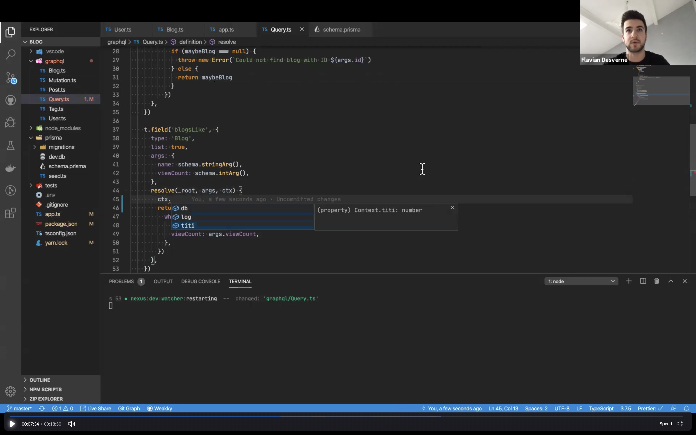
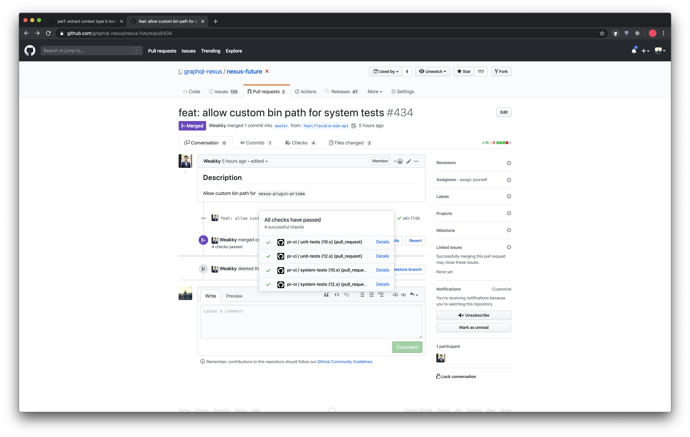
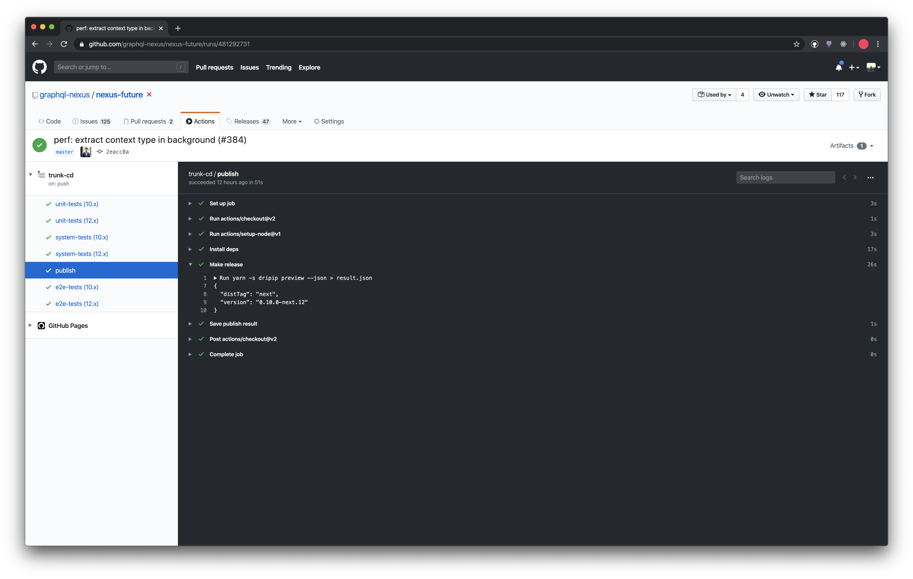
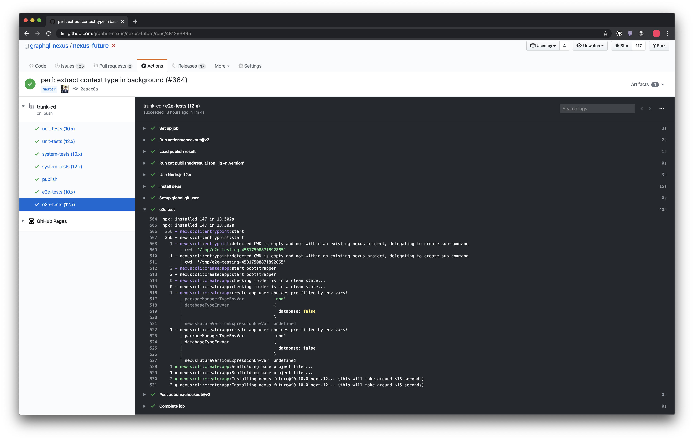
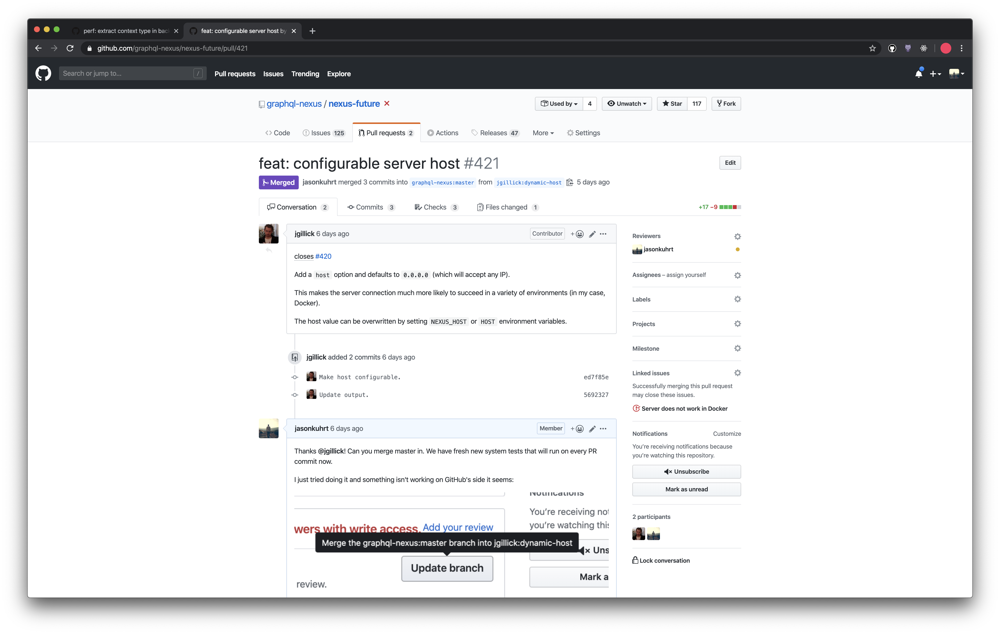
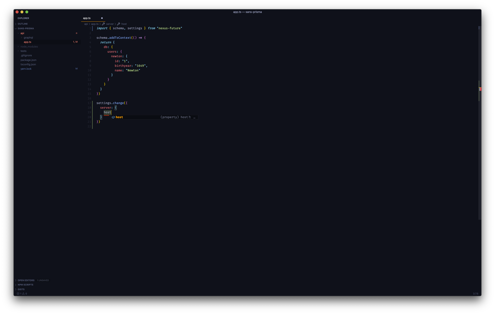
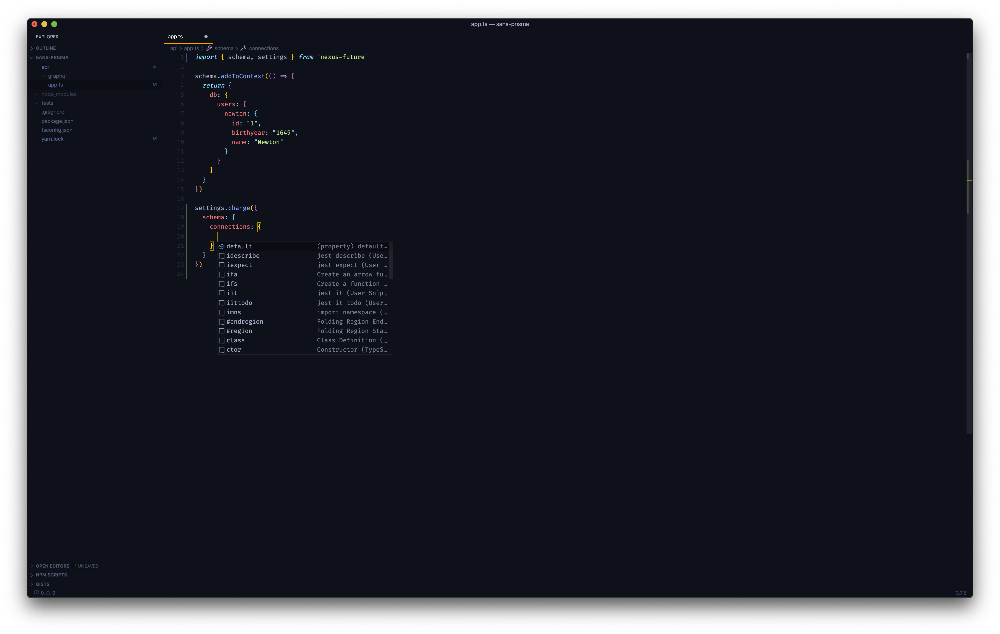
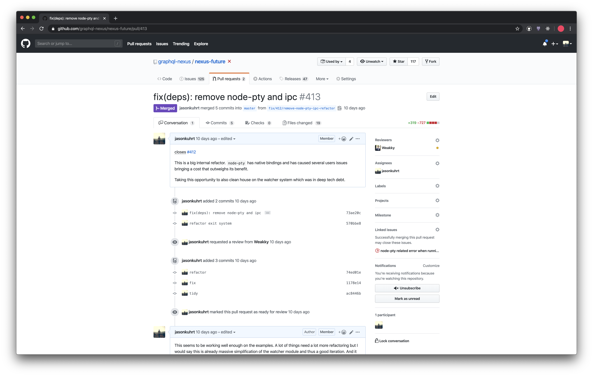

# Sprint 10 - Shiba Inu

## Goal

- Nexus E2E Tests
- Nexus Documentation

## Changelog

- ops: Automated preview releases
- tests: System tests on every PR, Trunk commit
- tests: E2E tests on every trunk commit
- docs: Work in progress Nexus API docs
- feat: configurable host
- improve: Context type extraction in background worker
- improve: simplified schema connections settings
- improve: remove node-pty (native bindings) & node-ipc

## Video

## Details

### tests: System tests on every PR, Trunk commit

### ops: Automated preview releases

### tests: E2E tests on every trunk commit

### docs: Work in progress Nexus API docs

### feat: configurable host

### improve: Context type extraction in background worker

### improve: simplified schema connections settings

### improve: remove node-pty (native bindings) & node-ipc

