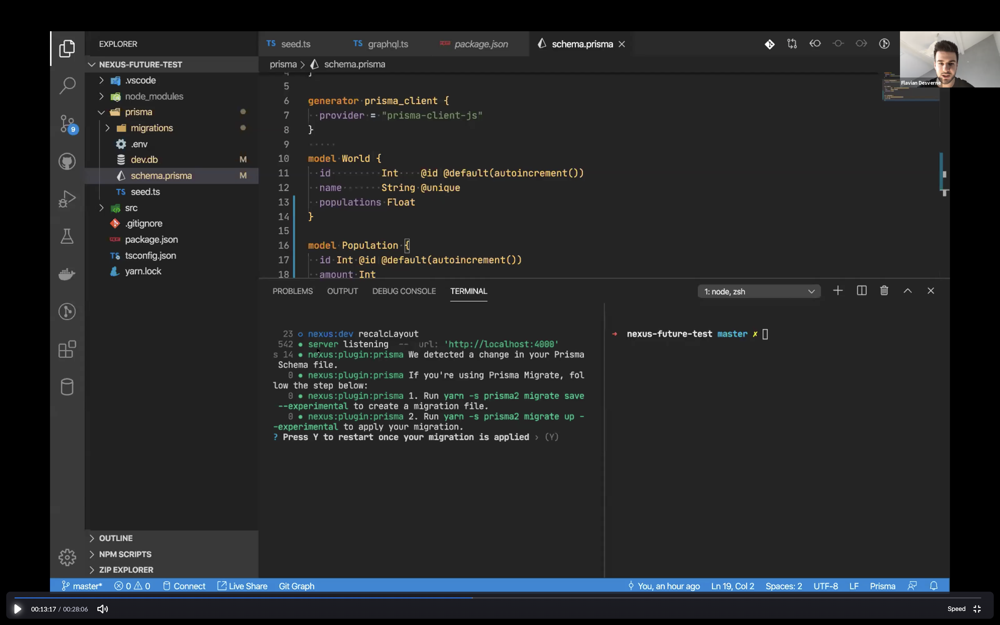
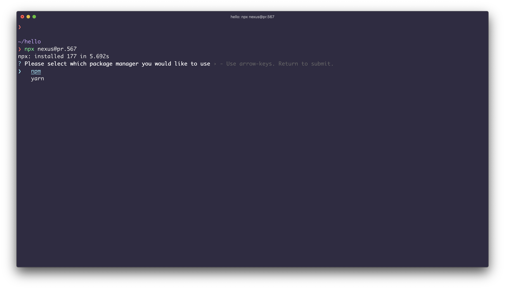
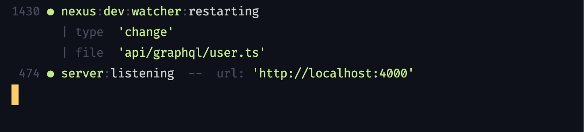
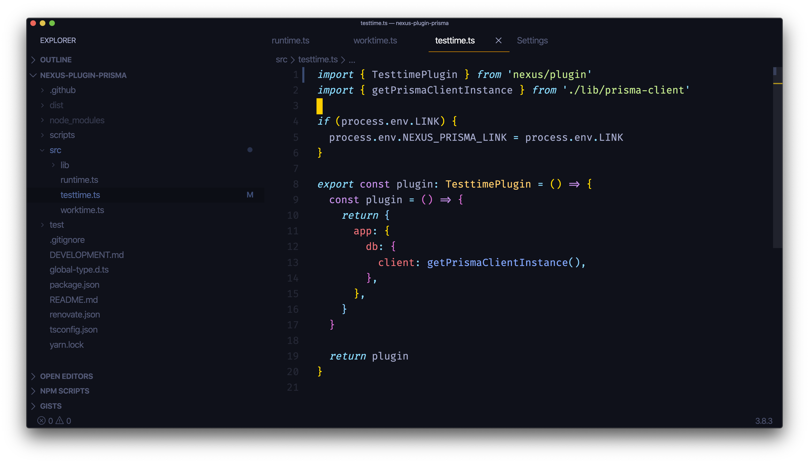
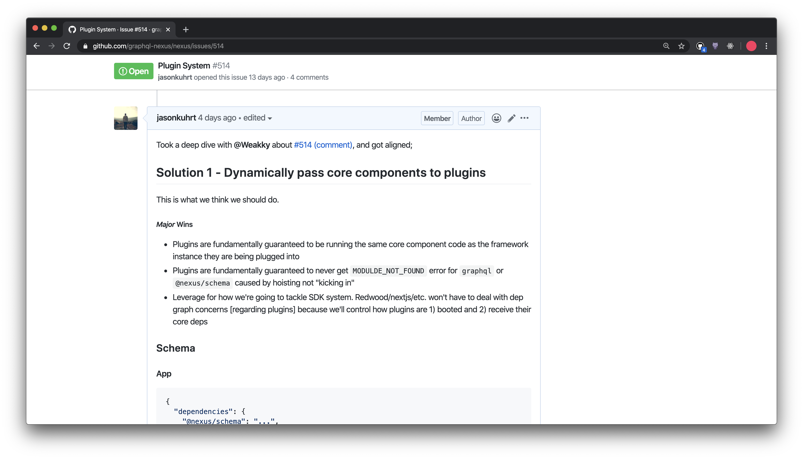
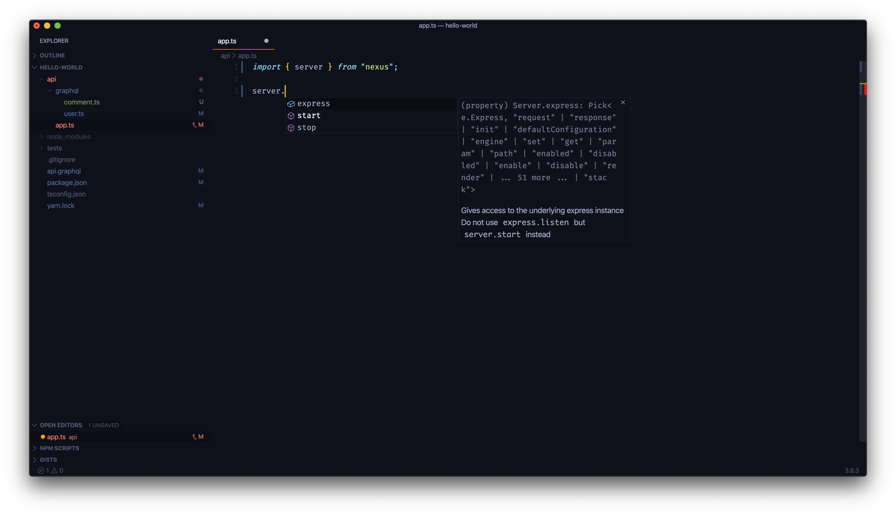
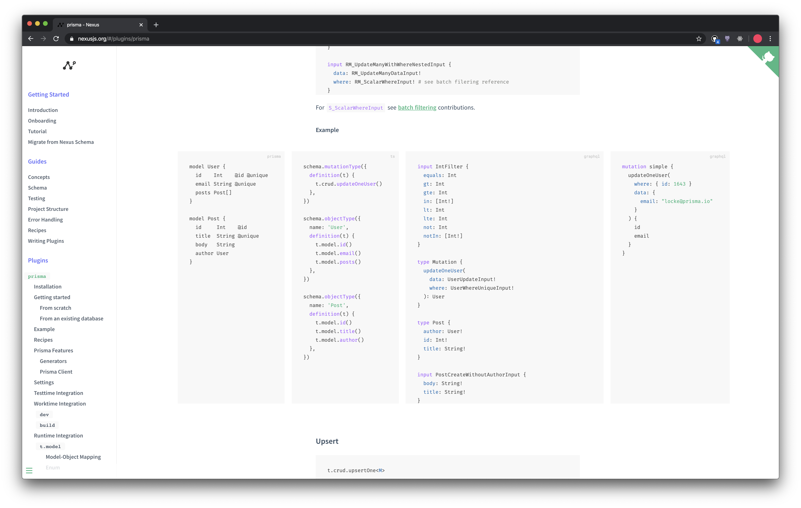

# Sprint 12 - Grand Chelem

## Goal

- Finish Nexus Transition
- Make Prisma Plugin functional

## Changelog

- `nexus-future`
  - unfeat: removed `nexus db`
  - unfeat: removed `server.custom`
  - perf: `nexus dev` refresh time `-1000ms`
  - feat: transitioned to nexus@0.20.0
  - feat: tree shakable plugin runtimes
  - design: plugin core deps design
  - tests: system test plugin system
  - improve: no ts-node in build system
  - improve: start module always inlines runtime plugins
- `nexus-plugin-prisma`
  - feat: support Prisma 2 preview 25
  - feat: no more auto-migrations
  - feat: support for introspection workflow
- Nexus website
  - Improved navigation
  - Standalone component docs
  - Code block height styles

## Video

## Details

### `nexus-future`

#### feat: transitioned to nexus@0.20.0

#### perf: `nexus dev` refresh time `-1000ms`

_before_

_after_

#### feat: tree shakable plugin runtimes

#### design: plugin core deps design

#### unfeat: removed `server.custom`

### Nexus Website

